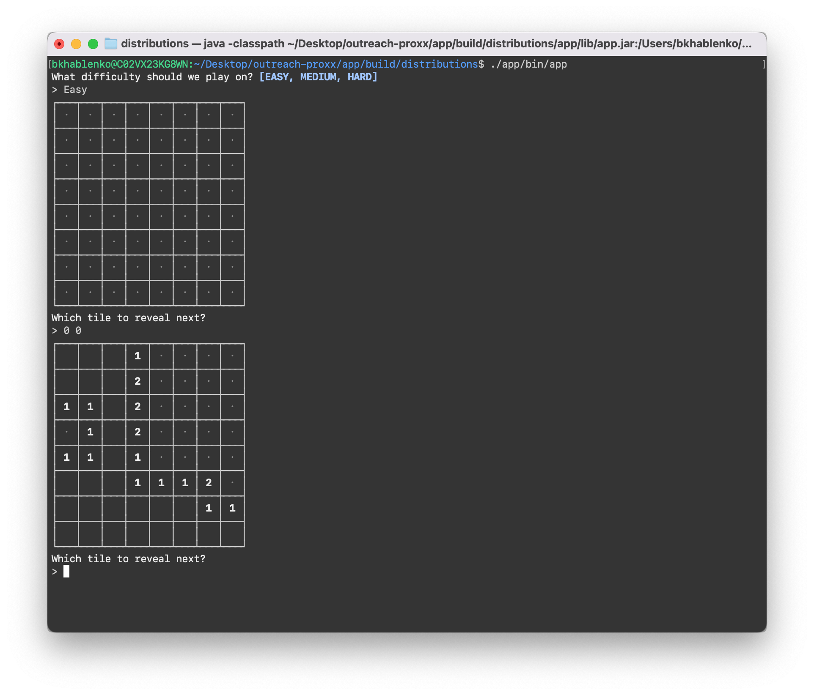

# outreach-proxx

[](https://circleci.com/gh/bkhablenko/outreach-proxx)

**NOTE:** The UI is beyond terrible, but at least it gives you *some* way of interacting with the game :shrug:



## How to run

```bash
./gradlew clean build -x test && docker compose run app
```

## TODO

[ ] Run the build command with Docker Compose
